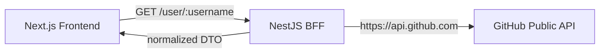

# Nacer Digital - GitHub Profile Challenge

[](https://nextjs.org/)
[](https://nestjs.com/)
[](https://www.typescriptlang.org/)
[](https://tailwindcss.com/)
[](https://www.docker.com/)
[](https://swagger.io/)
[](./.github/workflows/ci.yml)
[](./LICENSE)

Full Stack **GitHub Profile Viewer** built with a **NestJS** Backend-for-Frontend
and a **Next.js** frontend. The app loads the GitHub profile of `gustcas` by
default and lets you search any other GitHub username. The frontend **never**
talks to GitHub directly — every request goes through the NestJS backend, which
normalizes and secures the response.

---

## 📑 Table of contents

1. [Demo](#-demo)
2. [Screenshots](#-screenshots)
3. [Features](#-features)
4. [Architecture](#-architecture)
5. [Design patterns](#-design-patterns)
6. [Tech stack (real versions)](#-tech-stack-real-versions)
7. [Project structure](#-project-structure)
8. [Environment variables](#-environment-variables)
9. [Prerequisites](#-prerequisites)
10. [Local setup (without Docker)](#-local-setup-without-docker)
11. [Running with Docker](#-running-with-docker)
12. [API endpoints](#-api-endpoints)
13. [Response examples](#-response-examples)
14. [Swagger](#-swagger)
15. [Testing](#-testing)
16. [Lint & build](#-lint--build)
17. [Security](#-security)
18. [Dark mode](#-dark-mode)
19. [Deployment (Vercel + Render)](#-deployment-vercel--render)
20. [GitHub Actions](#-github-actions)
21. [Technical decisions](#-technical-decisions)
22. [Future improvements](#-future-improvements)
23. [Author](#-author)
24. [License](#-license)

---

## 🚀 Demo

| Service      | URL                                             |
| ------------ | ----------------------------------------------- |
| Frontend     | `https://TU_FRONTEND.vercel.app`                |
| Backend      | `https://TU_BACKEND.onrender.com`               |
| Swagger docs | `https://TU_BACKEND.onrender.com/api/docs`      |

> Replace the placeholders with your real URLs after deploying.

---

## 🖼️ Screenshots

Screenshots live in [`docs/screenshots/`](./docs/screenshots). Capture them from
the running app and drop them in:

| Light mode                                  | Dark mode                                 | Mobile                                        |
| ------------------------------------------- | ----------------------------------------- | --------------------------------------------- |
|  |  |  |

---

## ✨ Features

- 🔎 Search any GitHub user; loads **`gustcas`** by default on first render.
- 🧩 Normalized profile card (avatar, name, bio, location, company, blog, join date).
- 📊 Stat cards: public repos, followers, following, public gists.
- 📁 Up to **6** public repositories (name, description, language, stars, forks, last update).
- 🧠 **Technologies** section derived exclusively from real repository languages — no invented data.
- 🌗 Light / dark mode with `next-themes` (system-aware, persisted, no hydration flash).
- ⏳ Full UI states: skeleton loading, error + retry, user-not-found, rate-limit, empty repositories.
- ♿ Accessible: semantic HTML, `aria-label`s, visible focus rings, keyboard friendly, `prefers-reduced-motion` respected.
- 📱 Fully responsive with subtle Tailwind animations.
- 📖 Swagger / OpenAPI documentation for the backend.

---

## 🏗️ Architecture

- **Decoupled client-server**: independent frontend and backend, connected over HTTP.
- **Backend for Frontend (BFF)**: the NestJS backend is tailored to exactly what the frontend needs and hides GitHub's raw payload.
- **Modular, layered backend**: controller → service → adapter, organized by feature module.
- **Component-based frontend**: components, services, types and utilities are cleanly separated.
- **No microservices**: a single small backend is the right size for this scope.



Flow: **Next.js → NestJS → GitHub Public API**. The browser only ever knows
about the NestJS backend (`NEXT_PUBLIC_API_URL`); it has no knowledge of GitHub.

---

## 🎯 Design patterns

### Backend

| Pattern                    | Where                                                                 |
| -------------------------- | --------------------------------------------------------------------- |
| **Controller-Service**     | `GithubController` handles HTTP; `GithubService` owns the logic.      |
| **Adapter**                | `GithubUserAdapter` / `GithubRepositoryAdapter` map GitHub → DTO.     |
| **Dependency Injection**   | `HttpService` and `ConfigService` injected via Nest's DI container.   |
| **DTO**                    | Param + response DTOs (`class-validator`, Swagger decorators).        |
| **Facade / BFF (concept)** | The frontend only knows the backend, never GitHub.                    |

> The **Repository Pattern is intentionally omitted** — there is no database.

### Frontend

| Pattern                       | Where                                                            |
| ----------------------------- | --------------------------------------------------------------- |
| **Component Pattern**         | Small, reusable components under `components/`.                  |
| **Container / Presentational**| `app/page.tsx` holds state & data; child components take props. |
| **Service Layer**             | `services/github-profile.service.ts` centralizes all HTTP.      |
| **Provider Pattern**          | `ThemeProvider` wraps the app for light/dark theming.           |

---

## 🧰 Tech stack (real versions)

Versions below are taken from the installed `package.json` / lockfiles.

**Backend**

| Package             | Version |
| ------------------- | ------- |
| @nestjs/core        | 11.1.28 |
| @nestjs/common      | 11.1.28 |
| @nestjs/axios       | 4.0.1   |
| @nestjs/config      | 4.0.4   |
| @nestjs/throttler   | 6.5.0   |
| @nestjs/swagger     | 11.4.6  |
| class-validator     | 0.14.4  |
| helmet              | 8.3.0   |
| axios               | 1.18.1  |
| rxjs                | 7.8.2   |
| typescript          | 5.9.3   |
| jest                | 29.7.0  |

**Frontend**

| Package       | Version |
| ------------- | ------- |
| next          | 15.5.21 |
| react         | 19.0.0  |
| react-dom     | 19.0.0  |
| next-themes   | 0.4.6   |
| lucide-react  | 0.469.0 |
| tailwindcss   | 3.4.19  |
| typescript    | 5.9.3   |

Runtime: **Node.js 22** (works on Node 20+).

---

## 📂 Project structure

```
nacer-digital-github-profile-challenge/
├── backend/
│   ├── src/
│   │   ├── common/filters/http-exception.filter.ts   # consistent error shape
│   │   ├── github/
│   │   │   ├── adapters/                              # GitHub -> DTO (Adapter)
│   │   │   ├── controllers/github.controller.ts       # HTTP layer
│   │   │   ├── services/github.service.ts             # logic + GitHub integration
│   │   │   ├── dto/                                    # param & response DTOs
│   │   │   ├── interfaces/                             # raw GitHub API shapes
│   │   │   └── github.module.ts
│   │   ├── health/health.controller.ts                # liveness probe
│   │   ├── app.module.ts                              # config, throttler, module wiring
│   │   └── main.ts                                    # helmet, CORS, validation, Swagger
│   ├── Dockerfile
│   └── .env.example
├── frontend/
│   ├── src/
│   │   ├── app/                                        # layout, page (container), globals
│   │   ├── components/
│   │   │   ├── profile/                                # profile-card, profile-stats, repository-*
│   │   │   ├── layout/                                 # header, footer
│   │   │   ├── ui/                                     # theme-toggle, search-form, states
│   │   │   └── providers/theme-provider.tsx
│   │   ├── services/github-profile.service.ts          # Service Layer
│   │   ├── types/github-profile.types.ts
│   │   └── lib/utils.ts
│   ├── Dockerfile
│   └── .env.example
├── .github/workflows/ci.yml
├── docs/screenshots/
├── docker-compose.yml
├── package.json          # optional root convenience scripts
└── README.md
```

---

## 🔐 Environment variables

### Backend — `backend/.env`

| Variable       | Required | Default                 | Description                                            |
| -------------- | -------- | ----------------------- | ------------------------------------------------------ |
| `PORT`         | no       | `3001`                  | Port the API listens on.                               |
| `FRONTEND_URL` | no       | `http://localhost:3000` | Allowed CORS origin.                                   |
| `GITHUB_TOKEN` | no       | _(empty)_               | Optional PAT used **only server-side** to raise the GitHub rate limit. |

### Frontend — `frontend/.env.local`

| Variable              | Required | Default                 | Description                          |
| --------------------- | -------- | ----------------------- | ------------------------------------ |
| `NEXT_PUBLIC_API_URL` | yes      | `http://localhost:3001` | Base URL of the backend (browser).   |

> 🔒 There is **no** `NEXT_PUBLIC_GITHUB_TOKEN`. Tokens never reach the browser.

---

## ✅ Prerequisites

- **Node.js 20+** (22 recommended) and **npm**.
- **Docker** + Docker Compose (optional, only for the containerized flow).

---

## 💻 Local setup (without Docker)

### Backend

```bash
cd backend
npm install
cp .env.example .env        # Windows: copy .env.example .env
npm run start:dev
# API   -> http://localhost:3001
# Docs  -> http://localhost:3001/api/docs
```

### Frontend

```bash
cd frontend
npm install
cp .env.example .env.local  # Windows: copy .env.example .env.local
npm run dev
# App -> http://localhost:3000
```

> **Windows note:** if `cp` is unavailable, use `copy` in CMD or
> `Copy-Item .env.example .env` in PowerShell — or just duplicate the file
> manually and rename it.

---

## 🐳 Running with Docker

From the project root:

```bash
docker compose up --build
```

- Frontend → `http://localhost:3000`
- Backend  → `http://localhost:3001`
- Swagger  → `http://localhost:3001/api/docs`

To pass a GitHub token to the backend container:

```bash
GITHUB_TOKEN=ghp_xxx docker compose up --build
```

Stop everything:

```bash
docker compose down
```

> `NEXT_PUBLIC_API_URL` stays `http://localhost:3001` because it is consumed by
> the **browser**, which must reach the backend on the host — not by the internal
> Docker network. The Docker service hostname is intentionally **not** used here.

---

## 🔌 API endpoints

| Method | Endpoint                        | Description                                        |
| ------ | ------------------------------- | -------------------------------------------------- |
| `GET`  | `/user/:username`               | Normalized GitHub profile.                         |
| `GET`  | `/user/:username/repositories`  | Up to 6 public repos sorted by last update.        |
| `GET`  | `/health`                       | Liveness probe.                                    |

**Error mapping**

| Condition                    | HTTP status | Message                              |
| ---------------------------- | ----------- | ------------------------------------ |
| Invalid username             | `400`       | validation message                   |
| GitHub 404                   | `404`       | `GitHub user not found`              |
| GitHub 403 / 429 (rate limit)| `429`       | rate limit message                   |
| Request timeout (5s)         | `504`       | timeout message                      |
| Network error / GitHub down  | `502`       | generic upstream message             |

---

## 📦 Response examples

`GET /user/gustcas`

```json
{
  "username": "gustcas",
  "name": "Gustavo Pachacama",
  "avatarUrl": "https://avatars.githubusercontent.com/u/68200435?v=4",
  "bio": "Full Stack Developer",
  "location": "Ecuador",
  "company": null,
  "blog": "https://frolicking-rabanadas-6d9204.netlify.app",
  "publicRepos": 22,
  "publicGists": 0,
  "followers": 0,
  "following": 0,
  "githubUrl": "https://github.com/gustcas",
  "createdAt": "2020-07-12T18:45:37Z",
  "updatedAt": "2026-07-10T21:11:37Z"
}
```

`GET /user/gustcas/repositories`

```json
[
  {
    "id": 123456789,
    "name": "awesome-project",
    "description": "A short project description",
    "htmlUrl": "https://github.com/gustcas/awesome-project",
    "homepage": "https://awesome-project.vercel.app",
    "language": "TypeScript",
    "topics": ["nestjs", "nextjs"],
    "stars": 12,
    "forks": 3,
    "createdAt": "2020-07-12T18:45:37Z",
    "updatedAt": "2026-01-01T00:00:00Z"
  }
]
```

Error body (`GET /user/-invalid`)

```json
{
  "statusCode": 400,
  "message": "username must be a valid GitHub username (alphanumeric and single hyphens, not at the start or end)",
  "error": "Bad Request",
  "timestamp": "2026-01-01T00:00:00.000Z",
  "path": "/user/-invalid"
}
```

---

## 📘 Swagger

Interactive OpenAPI docs are available at:

```
http://localhost:3001/api/docs
```

Both endpoints, their parameters, success responses and main error codes are
documented via Swagger decorators on the controller and DTOs.

---

## 🧪 Testing

Backend unit tests use **Jest** with a **mocked `HttpService`** — no real
network calls to GitHub are made.

```bash
cd backend
npm test          # run all specs
npm run test:cov  # with coverage
```

Covered scenarios:

- `GithubUserAdapter` and `GithubRepositoryAdapter` mapping (incl. null handling & 6-item cap).
- `GithubService`: successful mapping, token header behavior, **404**, **rate limit (403 → 429)**, **timeout (→ 504)**, **network error (→ 502)**.
- `GithubController`: delegation to the service.

Frontend quality gates are **lint**, **TypeScript type-checking** and **build**.

---

## 🧹 Lint & build

```bash
# Backend
cd backend && npm run lint && npm test && npm run build

# Frontend
cd frontend && npm run lint && npm run build
```

Or from the root:

```bash
npm run lint      # lints both
npm run build     # builds both
```

---

## 🛡️ Security

- **Helmet** sets secure HTTP headers.
- **Restricted CORS** — only `FRONTEND_URL`, `GET` only.
- **Rate limiting** via `@nestjs/throttler` (30 req/min per IP).
- **5-second timeout** on every outbound GitHub request.
- **Global `ValidationPipe`** (`whitelist`, `forbidNonWhitelisted`, `transform`).
- **Username validation** with a strict GitHub-compatible regex.
- **Global exception filter** returns a consistent, safe error shape — **no stack traces** and no raw Axios errors leak to the client.
- **`GITHUB_TOKEN` stays server-side only**; there is no `NEXT_PUBLIC_GITHUB_TOKEN`, and secrets are never committed (`.env` is gitignored, only `.env.example` is tracked).

---

## 🌗 Dark mode

- Toggle in the header with a sun/moon icon and an `aria-label`.
- Powered by `next-themes` (`attribute="class"`), so Tailwind's class-based dark mode applies.
- Respects the **system theme** initially, then **persists** the user's choice.
- `suppressHydrationWarning` on `<html>` + a mounted guard on the toggle prevent hydration mismatches.
- Every surface, border, text and button is styled for both themes with accessible contrast.

---

## ☁️ Deployment (Vercel + Render)

> These steps are documented, not executed automatically.

### Frontend → Vercel

1. Import the repository into Vercel and set the **root directory** to `frontend`.
2. Framework preset: **Next.js** (build `npm run build`, output auto-detected).
3. Add the environment variable:
   - `NEXT_PUBLIC_API_URL = https://TU_BACKEND.onrender.com`
4. Deploy.

### Backend → Render

1. Create a new **Web Service** from the repo with **root directory** `backend`.
2. Build command: `npm ci && npm run build` — Start command: `npm run start:prod`.
3. Add environment variables:
   - `PORT` (Render provides one; the app reads `PORT`)
   - `FRONTEND_URL = https://TU_FRONTEND.vercel.app`
   - `GITHUB_TOKEN = ` _(optional)_
4. Deploy, then point the Vercel `NEXT_PUBLIC_API_URL` at the Render URL.

**Vercel variables:** `NEXT_PUBLIC_API_URL`
**Render variables:** `PORT`, `FRONTEND_URL`, `GITHUB_TOKEN` (optional)

---

## 🤖 GitHub Actions

[`.github/workflows/ci.yml`](./.github/workflows/ci.yml) runs on **push** and
**pull_request** with two independent jobs on **Node 22**:

- **Backend:** `npm ci` → `lint` → `test` → `build`
- **Frontend:** `npm ci` → `lint` → `build`

No secrets are required or used.

---

## 🧠 Technical decisions

- **No JWT / login / auth** — the app only reads public GitHub data; authentication would add complexity with no benefit for this scope.
- **No database** — nothing needs persistence; data is fetched live from GitHub, so the Repository Pattern is intentionally omitted.
- **No microservices** — a single small BFF matches the problem size; microservices would be over-engineering.
- **Frontend consumes the backend only** — keeps GitHub tokens server-side, centralizes error handling/rate limiting, and lets us reshape the payload (BFF).
- **Adapter Pattern** — isolates GitHub's response shape so the rest of the app depends on a stable internal DTO; if GitHub changes, only the adapter changes.
- **Optional `GITHUB_TOKEN`** — the app works unauthenticated (60 req/h); adding a token raises the limit (5000 req/h) without changing any code.

---

## 🔭 Future improvements

Not implemented on purpose, to keep the challenge focused:

- Response **caching** (in-memory or HTTP cache headers).
- **Redis** for shared/distributed caching.
- **End-to-end** tests (Playwright / Cypress).
- **OpenTelemetry** tracing & metrics.
- Repository **pagination**.
- Switching to the **GitHub GraphQL** API for finer-grained queries.

---

## 👤 Author

**Gustavo Pachacama**

- GitHub: <https://github.com/gustcas>
- LinkedIn: <https://www.linkedin.com/in/gustavo-pachacama-7b3b4124a/>
- Portfolio: <https://frolicking-rabanadas-6d9204.netlify.app/>

---

## 📄 License

Released under the [MIT License](./LICENSE).

> Data is provided by the **public GitHub API**, consumed through the NestJS backend.
